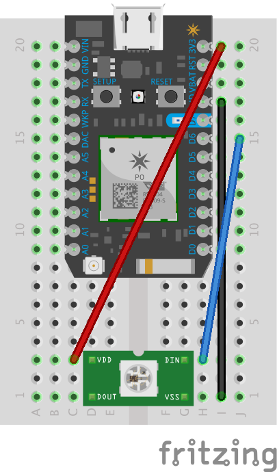
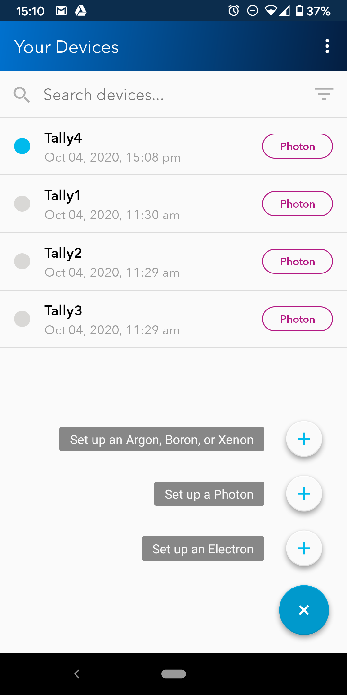
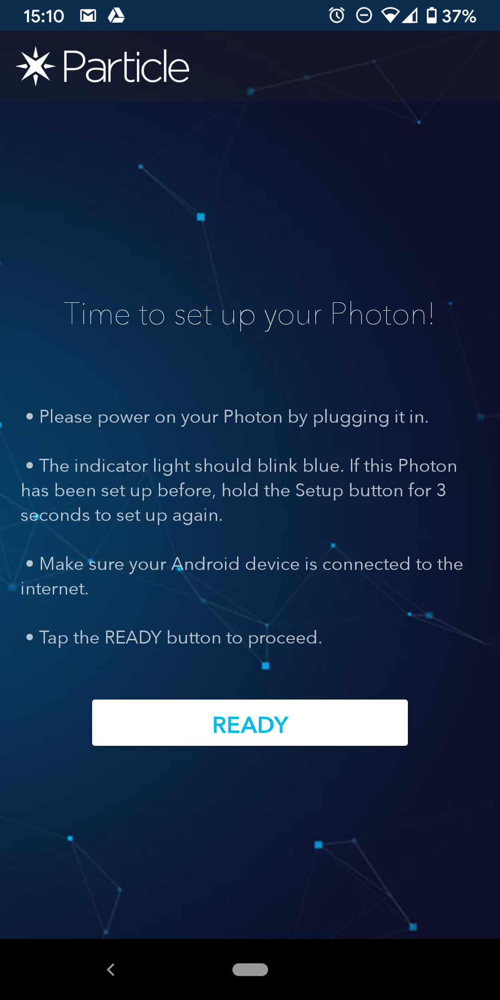
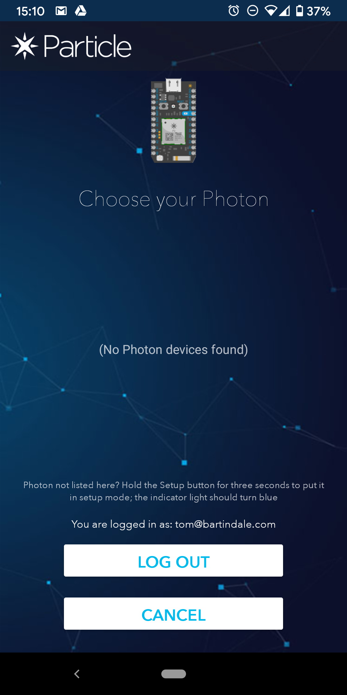
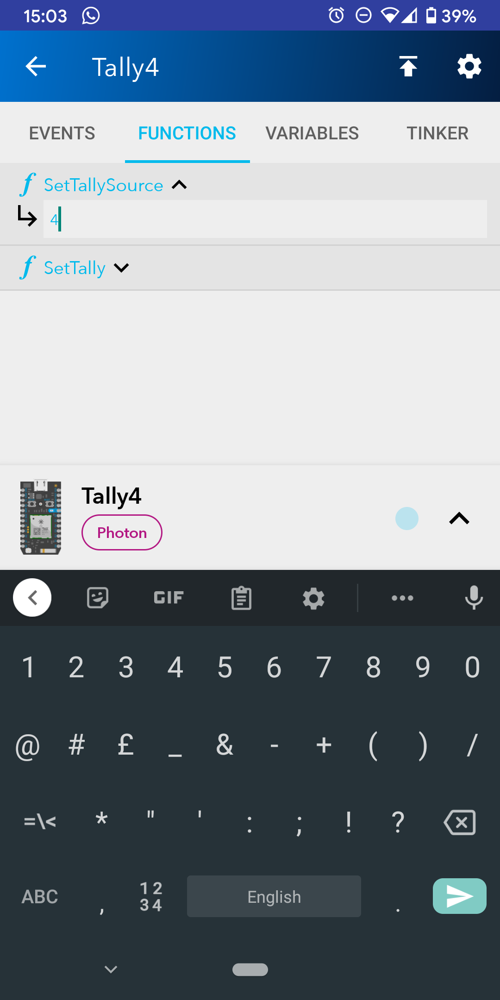

# Open Tally

Tally light system for local or remote camera sources.

## What it Does

> Image: a tally source (OBS or ATEM), remote or local, a tally destination (web or physical)

Some specifics:
- OBS (software) or Black Magic ATEM mixers can be used as the tally source.
- Any combination of web or hardware tally lights can be used simultaneously.
- Web tally can be used from a remote location (e.g. at the remote end of a zoom call used in OBS)

## Quickstart

1. Download the bridge from [https://github.com/tombartindale/opentally/releases/latest](GitHub) for your platform.

2. Unzip, and use one of the shortcuts to start the bridge.

One instance of the bridge needs to run on a device on the same network as the tally source.

If you run bridge with `online` mode enabled, a browser will open asking you to authenticate using a Google login. This is just so that your bridge can be consistently identified with the Web client, and that only your bridge can adjust tally information for your production.

::: OBS

To use OBS, you need to install the [Websocket plugin](https://obsproject.com/forum/resources/obs-websocket-remote-control-obs-studio-from-websockets.466/) to OBS for OpenTally to work.

:::

## Extra Options

You can start Open Tally in a terminal with a variety of extra options:

`$ OpenTallyBridgeCore [SOURCE]`

| | |
|-|-|
|**-o, --offline**|Only connect offline (without firebase)|
|**-c, --password**|Password for client connections (not implemented yet)|

`$ OpenTallyBridgeCore atem`

| | |
|-|-|
|**\--help**|Display the following information|
|**\--name**|Name to identify your device|

`$ OpenTallyBridgeCore obs`

| | |
|-|-|
|**-p, --obspassword**|Password for local OBS|
|**-h, --host**|Host for local OBS|
|**-t, --port**|Port for local OBS|

## Tally Lights

There are two options to use as a tally light, and they can be used in any combination for any source.

### Web

Visit https://obstally.web.app from any device to access the web tally.

The web client works from any browser. Once you have the bridge running, your Tally source will appear in the list of available productions in the client. Just select a tally source (or the Program Out).

The screen will:
 Turn solid red when the source is selected and streaming or recording in occurring.
- Flash red when the source is selected but no streaming or recording is occurring.

*URLs are persistent, so you can bookmark the link for a specific production and/or tally source on your device.*

### Physical

Once connected to the same WiFi network as the bridge, each device will:
- Turn solid red when the source is selected and streaming or recording in occurring.
- Flash red when the source is selected but no streaming or recording is occurring.

## Constructing Physical Tallys

Parts:
- 1 x Particle Photon WiFi Board
- 1 x Neopixel/WS2812B LED
- 1 x Translucent kit box
- File downloaded from: 

**Instructions**

1. Solder the Photon and LED together in the following way:

2. Use the Particle mobile app to register the Photon with your Particle account

3. Use the [Particle Workbench](https://www.particle.io/workbench/) to deploy the code onto the Photon

    1. In Particle workbench, `CMD+Shift P`, and select `Launch CLI`.

    

    2. Connect the Photon via USB.

    3. In Terminal run `particle flash --usb firmware.bin`

4. Use the Particle mobile app [Android](https://play.google.com/store/apps/details?id=io.particle.android.app) or [iOS](https://apps.apple.com/us/app/particle-iot/id991459054) to join the Photon to the same WiFi network that your bridge is running on:

5. Use the Particle App to set the Tally channel that the device should respond to.

`Call the SetTallySource function and set it to a tally channel`

